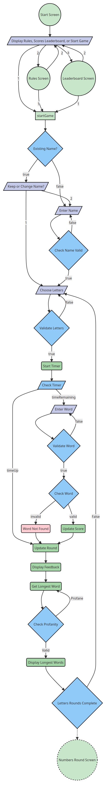
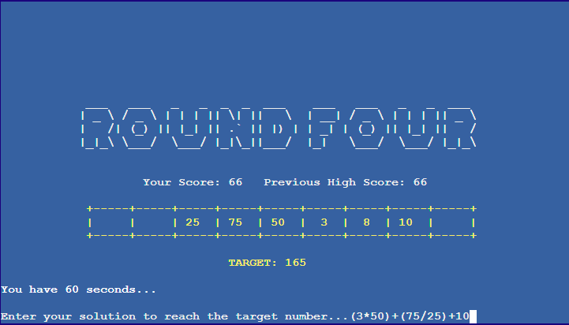
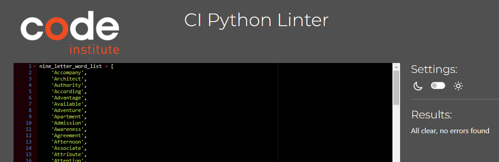

# Countdown Game
(Developer: Matthew Shepherd)


[Live webpage](https://countdown-game-ccaca8c4e1a7.herokuapp.com/)

## Table of Contents

1. [Project Goals](#project-goals)
    1. [User Goals](#user-goals)
    2. [Site Owner Goals](#site-owner-goals)
2. [User Experience](#user-experience)
    1. [Target Audience](#target-audience)
    2. [User Requirements and Expectations](#user-requirements-and-expectations)
    3. [User Stories](#user-stories)
3. [Technical Design](#technical-design)
    1. [Flowchart](#flowchart)
4. [Technologies Used](#technologies-used)
    1. [Languages](#languages)
    2. [Frameworks & Tools](#frameworks-&-tools)
5. [Features](#features)
6. [Testing](#testing)
    1. [Browser compatibility](#browser-compatibility)
    2. [PEP8 Python Validator](#PEP8-Python-Validator)
    3. [Manual Testing](#manual-testing)
    4. [Automated Testing](#automated-testing)
    5. [Testing user stories](#testing-user-stories)
8. [Bugs](#Bugs)
9. [Deployment](#deployment)
    - [Deploying in Heroku](#deploying-the-website-in-heroku)
    - [Forking the GitHub Repository](#forking-the-github-repository)
    - [Cloning of Repository in GitHub](#cloning-the-repository-in-github)
10. [Credits](#credits)
11. [Acknowledgements](#acknowledgements)

## Project Goals 
The goals of this app include:

### Site Owner Goals
- Create a fun interactive game that furthers my understanding of problem solving through code and the Python language
- Ensure the user understands the rules of the game
- Ensure the user is provided with clear instructions on how to play on each screen
- Ensure the user is provided with clear feedback on any errors and how to proceed
- Allow the user to keep track of their score in the game
- Allow the user to have their score displayed on the leaderboard if it is a top ten high score

### User Goals
- Play a fun, family-friendly, interactive online numbers and words puzzle game similar to the U.K. T.V. gameshow Countdown 
- Quickly understand the rules of the game and how to play
- Be able to keep track of the game score and try to beat their previous high score
- Learn from the game through suggested words and number solutions 
- Play the game as often as desired
- Achieve a top ten high score that appears on the game leaderboard

[Back to Table of Contents](#table-of-contents)

## User Experience

### Target Audience
- Countdown is typically played by anyone age 12 and up, that can follow the rules to solve challenging word and number games.

### User Requirements and Expectations
- An intuitive and easy to navigate game interface
- A fun, family-friendly, and educational gameplay experience with feedback on word and number game solutions
- Ability to quickly find game rules, view the score leaderboard, or start the game
- Ability to personalise the game by entering a player name
- Score tracking during the game and feedback if a top ten score is achieved
- Clear feedback on any input errors during gameplay and how to proceed
- Ability to have their name and score added to the leaderboard if a top ten score is achieved


### User Stories
I have divided my user stories into users and the site owner, as each of these users will have a distinct set of needs and goals.

#### Users
1. As a user, I want to play a fun, family-friendly, challenging, and educational game.
2. As a user, I want to be able to view the rules of the game.
3. As a user, I want to be able to view the high scores leaderboard.
4. As a user, I want to be able to enter my player name to personalise my game experience and track my score.
5. As a user, I want the game to remember my name if I play again and have the choice to keep my name or change it.
6. As a user, I want my input to be validated with clear feedback on how to correct any input errors. 
7. As a user, I want to be given clear instructions on each screen on how to play the game and how to progress.
8. As a user, I want feedback on my word and number guesses with potential solutions provided by the game.
9. As a user, I want to be provided with a score for each round and keep track of my current score and previous high score as the game progresses.
10. As a user, I want to be told when the game is over, the score I achieved, my high score, and be shown the leaderboard if I achieve a top ten high score.

#### Site Owner 
11. As the site owner, I want to provide a fun, family-friendly, challenging, and educational game.
12. As the site owner, I want to ensure users understand the rules of the game and are provided clear instructions on how to play throughout the game.
13. As the site owner, I want to ensure input is validated to avoid the game breaking or errors displaying that will cause a poor user experience.
14. As the site owner, I want to ensure the user can keep playing the game while retaining their name and high score.

[Back to Table of Contents](#table-of-contents)

## Technical Design

### Flowchart
A flowchart of the game flow and logic was created using Mermaid Chart:

<details><summary>Game Introduction and Letters Round Flowchart</summary>

</details>
<details><summary>Numbers Round Flowchart</summary>

</details>
<details><summary>Conundrum Round and Game Over Flowchart</summary>

</details>

### Data Model
- Five classes were used to represent key elements of the game:
    - Screen - Contains the attributes and methods of all game screen elements to be rendered. Called by round_handler to create Screen object instances to render the correct screen elements depending on the screen_data_param and/or round_number.
    - Player - Contains all player attributes. Keeps track of player name, score, letters, numbers, and words as the player progresses through rounds of the game. Contains a method to update player scores.
    - Numbers - Contains all types of numbers to choose from and solve for in the numbers round and numbers generation methods.
    - Letters - Contains all letter types and letters to choose from in the letters round and letter generation methods.
    - Conundrums - Contains the Conundrum word attributes for the Conundrum round and methods to populate and solve the conundrum.
- Three text files were used to store and reuse blocks of ASCII art and text to be displayed at the beginning of the game screen render or on the rules screen.
    - intro_screen_data.txt - Welcome message in ASCII tiles and sub-heading
    - game_screen_data.txt - Countdown heading in ASCII tiles
    - rules_screen_data.txt - Rules heading in ASCII tiles and rules text
- A Set was used to create a word set against which the anagram solver could check for valid words. This was used instead of checking against PyDictionary as calls to PyDictionary for a large number of potential words turned out to be expensive, blocking code execution for long periods of time.
    - word_set.py
- A List was used to store nine letter words for use in the conundrum round as anagrams. This was used instead of word_set as the larger set of words contains less common words that would be harder for the user to guess. The list was generated from a set of commonly used 9-letter words.
    - nine_letter_word_list.py
- Google Sheets and the Google Sheets API were used to store high score data to create the top ten leaderboard. This allows player names and scores to persist beyond the game session if the user achieves a top ten high score.


[Back to Table of Contents](#table-of-contents)

## Technologies Used

### Languages
- [Python](https://www.python.org/)

### Tools
- [Mermaid Chart](https://mermaid.js.org/)
- [Git](https://git-scm.com/)
- [GitHub](https://github.com/)
- [CodeAnywhere](https://codeanywhere.com/)
- [Heroku](https://heroku.com/)
- [Coverage.py](https://coverage.readthedocs.io/en/7.2.7/) 

### Python Libraries
- [time](https://docs.python.org/3/library/time.html) was used to calculate the time taken for the user to submit a value in the timed input and to access the sleep method to pause code execution.
- [re](https://docs.python.org/3/library/re.html) was used to access the search and findall methods and use regular expressions in the game's validation function to find valid and invalid characters in user input.
- [random](https://docs.python.org/3/library/random.html) was used to access the following methods: radint to generate random 3-digit integers in the numbers round; sample to randomly select letters, numbers, and conundrum words; and shuffle to shuffle the list of vowels and consonants and to generate variations of the conundrum letters to find potential anagram solutions.
- [termios](https://docs.python.org/3/library/termios.html) was used in the wait_for_keypress function to pause code execution until a key is pressed. The following methods were used: tcgetattr to retrieve the current terminal attributes associated with the standard input (stdin), tcsetattr to restore the original terminal settings after modifying them temporarily for capturing user input, TCSADRAIN is used to indicate that the changes to the terminal attributes stored should be applied after any pending output from the terminal has been transmitted.
- [sys](https://docs.python.org/3/library/sys.html) was used in the wait_for_keypress function to pause code execution until a key is pressed. The following methods were used: sys.stdin to access methods for reading input from the user such as sys.stdin.read; sys.stdin.fileno to return the file descriptor associated with the standard input; sys.stdin.flush to clear the internal buffer associated with the standard input
- [tty](https://docs.python.org/3/library/tty.html) was used to access the setraw method to sets the terminal mode to raw mode for the standard input (stdin). In raw mode, input is read character by character without any line editing or processing.
- [collections](https://docs.python.org/3/library/collections.html) was used to access the Counter method which was used to create dictionaries of letter and number counts to check the user's inputted letter or numbers only used the available letters or numbers.
- [unittest](https://docs.python.org/3/library/unittest.html) was used to create automated unit tests of the game's validation functions

### Third Party Python Libraries
- [Colorama](https://pypi.org/project/colorama/) was used to access the Fore, Back, Style and clear_screen methods to change the terminal background and text colours and to clear the terminal screen.
- [Inputimeout](https://pypi.org/project/inputimeout/) was used to create timed user inputs for the guessing stage of each round. 
- [Art](https://pypi.org/project/art/) was used to access the text2art method to convert text to ASCII art for the screen headings.
- [Num2words](https://pypi.org/project/num2words/) was used to convert round numbers to their word equivalent to print as screen headings for each new round.
- [Pager](https://pypi.org/project/pager/) was used to output the rules_screen_data text file on the rules screen in a paged format, pausing output when the terminal screen is full of text until the user presses a key to load the next section of the rule file's content.
- [PyDictionary](https://pypi.org/project/PyDictionary/) was used to check the user's inputted words are valid and to retrieve word meanings for suggested word solutions on the letters round feedback screen.
- [Alt-profanity-check](https://pypi.org/project/alt-profanity-check/) was used to check the user's name and solution input text doesn't contain profanity and to check the conundrum word doesn't contain profanity.  
- [Numexpr](https://pypi.org/project/numexpr/2.6.1/) was used to evaluate the user's number round string to return the result of the user's inputted expression to compare to the target number. This was used to avoid using insecure methods such as eval().
- [anagram_solver](https://github.com/patrickleweryharris/anagram-solver) was used to find the longest potential words using the letters provided in the letters round so the user could learn potential approaches to solving the problem. As a 9-letter word can generate 362,880 permutations, brute force checking all of these against a dictionary is extremely time-consuming. As such, I took the approach of generating 3 random lists of the provided letters for words between 9 and 4 letters long and checking these against anagram solver's dictionary. Not ideal, but functional.
- [Countdown_numbers_solver](https://pypi.org/project/countdown-numbers-solver/) was used to provide the user with solutions to the numbers round on the numbers round feedback screen so the user could learn potential approaches to solving the problem. 
- [gspread](https://docs.gspread.org/en/v5.10.0/) was used to access and update the high score leaderboard worksheet via Google Sheets.
- [google.oauth2.service_account](https://google-auth.readthedocs.io/en/master/reference/google.oauth2.service_account.html) was used to authorise the connection with the Google Sheets API to access the high score leaderboard worksheet.
- [prettytable](https://pypi.org/project/prettytable/) was used to provide an ASCII formatted table layout for the leaderboard high scores when output in the terminal.


[Back to Table of Contents](#table-of-contents)

## Features
The game consists of a series of screens with the following features:

### Introduction Screen
- Displays the game title and welcome message in ASCII art and a sub-heading.
- Prompts the user to start the game, read the game rules or view the high scores leaderboard.
- The prompt provides specific feedback if invalid values are entered.
- User stories covered: 1, 2, 3, 6, 7, 11, 12, 13
<details><summary>Screenshots</summary>

</details>

### Rules Screen
- Displays the game title and rules screen in ASCII art.
- Displays the game rules allowing the user to learn how to play the game.
- Outputs game rules in a paged format allowing the user to read the rules without having to scroll the terminal.
- The final page of rules provides the user with a prompt to return to start the game or return to the introduction screen.
- The prompt provides specific feedback if invalid values are entered.
- User stories covered: 1, 2, 6, 7, 11, 12, 13

<details><summary>Screenshots</summary>

</details>

### High Scores Screen
- Displays the game title in ASCII art and hall of fame in rainbow text.
- Outputs the high score leaderboard in an easy to read ASCII table format.
- Displays the most recent top ten player high scores and the corrsponding player name.
- Prompts the user to start the game or return to the introduction screen.
- The prompt provides specific feedback if invalid values are entered.
- User stories covered: 1, 3, 4, 7, 9, 11, 12, 13, 14

<details><summary>Screenshots</summary>

</details>

### Enter Name Screen
- Displays the game title in ASCII and a ready message in ASCII art.
- Displays the user's current score and any previous high score.
- Displays a user prompt asking the user to enter their name and briefly explains valid name formatting.
- If this is a repeat game, the prompt instead asks if the user wants to keep their existing name from their previous game or enter a new name.
- Stores the user name to display on the following screens and to record the user's score if a high score is achieved.
- The prompt provides specific feedback if invalid values are entered.
- User stories covered: 1, 4, 5, 6, 7, 11, 12, 13, 14

<details><summary>Screenshots</summary>
Enter Name Screen:


Enter Name Screen Remembers Name from Previous Game:

</details>

### Letters Round Screen
- Displays the round number and letter tiles in ASCII art.
- Displays the user's current score and any previous high score.
- Displays the user's name and a message to indicate the game is starting.
- Displays brief instructions on how to play the letters round.
- Displays a user prompt asking the user to choose the number of vowels they would like and briefly explains valid input formatting.
- The prompt provides specific feedback if invalid values are entered.
- User stories covered: 1, 4, 6, 7, 9, 11, 12, 13, 14

<details><summary>Screenshots</summary>

</details>

### Show Letters Screen
- Displays the round number and chosen letters within tiles in ASCII art.
- Displays the user's current score and any previous high score.
- Displays brief instructions on how to play the letters round.
- Pauses and displays a message for the user to press a key when they are ready to start the timer and input their word.
- User stories covered: 1, 7, 9, 11, 12, 14

<details><summary>Screenshots</summary>

</details>

### Letters Guess Screen
- Displays the round number and chosen letters within tiles in ASCII art.
- Displays the user's current score and any previous high score.
- Displays a message indicating the 30 second timer has started.
- Displays a user prompt asking the user to input their longest word.
- The prompt provides specific feedback if invalid values or letters not shown in the chosen letters are entered.
- If the user fails to enter input within the time provided the input is removed, the user is told they didn't enter a solution within the time provided, and the game continues.
- User stories covered: 1, 6, 7, 9, 11, 12, 13, 14

<details><summary>Screenshots</summary>

</details>

### Letters Feedback Screen
- Displays the round number in ASCII art and chosen letters within ASCII art tiles.
- Displays the user's current score and any previous high score.
- Displays a message letting the user know their word is being checked in the dictionary as there can be a few seconds of a delay.
- If their word is found in the dictionary, the user is told their word was found, the length of their word, and the time they had remaining when they entered their word.
- If their word is found, the user's name is displayed along with the number of points they score for the round based on their word length and time remaining.
- If the user's word is not found the user is told the word was not found in the dictionary.
- Pauses and displays a message for the user to press a key when they are ready to see what words our 'dictionary corner' i.e. anagram solver function found.
- Displays a message that the game is checking what words the 'dictionary corner' has found as there can be a few seconds of a delay.
- Displays a list of words found using the chosen letters and the meaning of those words if available.
- Pauses and displays a message for the user to press a key when they are ready to proceed to the next round.
- If the player has completed three letters rounds the game progresses to the numbers round, otherwise, it repeats a letters round.
- User stories covered: 1, 4, 7, 8, 9, 11, 12, 13, 14

<details><summary>Screenshots</summary>
Letters Feedback Screen:


Letters Feedback Screen with Solutions:

</details>

### Numbers Round Screen
- Displays the round number and tiles in ASCII art.
- Displays the user's current score and any previous high score.
- Displays the user's name and a message to indicate the numbers round is starting.
- Displays brief instructions on how to play the numbers round.
- Displays a user prompt asking the user to choose the number of 'big numbers' they would like and briefly explains valid input formatting.
- The prompt provides specific feedback if invalid values are entered.
- User stories covered: 1, 4, 6, 7, 9, 11, 12, 13, 14

<details><summary>Screenshots</summary>

</details>

### Show Numbers Screen
- Displays the round number and chosen numbers within tiles in ASCII art.
- Displays the user's current score and any previous high score.
- Displays the randomly generated target three digit number the user is solving for.
- Displays brief instructions on how to play the numbers round, including which operators are allowed, and a reminder to consider order of operations.
- Pauses and displays a message for the user to press a key when they are ready to start the timer and input their solution.
- User stories covered: 1, 7, 9, 11, 12, 14

<details><summary>Screenshots</summary>

</details>

### Numbers Guess Screen
- Displays the round number and chosen numbers within tiles in ASCII art.
- Displays the user's current score and any previous high score.
- Displays the randomly generated target three digit number the user is solving for.
- Displays a message indicating the 60 second timer has started.
- Displays a user prompt asking the user to input their solution to reach the target number.
- The prompt provides specific feedback if invalid values, invalid operators, or numbers not shown in the chosen numbers are entered.
- If the user fails to enter input within the time provided the input is removed, the user is told they didn't enter a solution within the time provided, and the game continues.
- User stories covered: 1, 6, 7, 9, 11, 12, 13, 14

<details><summary>Screenshots</summary>

</details>

### Numbers Feedback Screen
- Displays the round number in ASCII art and chosen numbers within ASCII art tiles.
- Displays the user's current score and any previous high score.
- Displays a message letting the user know their solution is being checked as there can be a few seconds of a delay.
- If the user solution achieves the target number, the user is shown their solution and its evaluated answer and the time they had remaining when they entered their solution.
- If their solution is valid, the user's name is displayed along with the number of points they score for the round based on their correct answer and time remaining.
- If the user's solution does not achieve the target number, the user is shown their solution and its evaluated answer, and if they were within 50 of the target number, how close to the target number they got.
- Pauses and displays a message for the user to press a key when they are ready to see what solutions our 'maths wiz' i.e. countdown solver function found.
- Displays a message that the game is checking what solutions the 'maths wiz' has found, in case there is a delay.
- Displays a list of all possible solutions to achieve the target number using the chosen numbers and available operators.
- Pauses and displays a message for the user to press a key when they are ready to proceed to the next round.
- User stories covered: 1, 7, 8, 9, 11, 12, 13, 14

<details><summary>Screenshots</summary>
Numbers Feedback Screen:


Numbers Feedback Screen with Solutions:

</details>

### Show Conundrum Screen
- Displays the round number and the scrambled conundrum letters within tiles in ASCII art.
- Displays the user's current score and any previous high score.
- Displays the user's name and a message to indicate the conundrum round is starting.
- Displays brief instructions on how to play the conundrum round.
- Pauses and displays a message for the user to press a key when they are ready to start the timer and input their word.
- User stories covered: 1, 4, 7, 9, 11, 12, 14

<details><summary>Screenshots</summary>

</details>

### Conundrum Guess Screen
- Displays the round number and the scrambled conundrum letters within tiles in ASCII art.
- Displays the user's current score and any previous high score.
- Displays a message indicating the 30 second timer has started.
- Displays a user prompt asking the user to input their conundrum solution.
- The prompt provides specific feedback if invalid values or letters not shown in the conundrum letters are entered.
- If the user fails to enter input within the time provided the input is removed, the user is told they didn't enter a solution within the time provided, and the game continues.
- User stories covered: 1, 6, 7, 9, 11, 12, 14

<details><summary>Screenshots</summary>

</details>

### Conundrum Feedback Screen
- Displays the round number in ASCII art and the unscrambled conundrum letters within ASCII art tiles.
- Displays the user's current score and any previous high score.
- If the user's conundrum solution matches the target word, the user is told their word is correct and the time they had remaining when they entered their word.
- If the user's conundrum solution matches the target word, the user's name is displayed along with the number of points they score for the round based on their correct answer and time remaining.
- If the user's conundrum solution does not match the target word but uses all of the conundrum letters and the word is found in the dictionary the user's solution is accepted as valid. The user is told that this wasn't the target word but is still valid, and the user's name is displayed along with the number of points they score for the round based on their valid answer and time remaining.
- Pauses and displays a message for the user to press a key when they are ready to continue.
- User stories covered: 1, 4, 7, 8, 9, 11, 12, 13, 14

<details><summary>Screenshots</summary>

</details>

### Game Over Screen
- Displays 'Game Over' in ASCII art and 'Countdown' within ASCII art tiles.
- Displays a congratulations message in rainbow text.
- Displays the user's final score and their highest score so far for this game session.
- If the user's score for this game beats an existing top ten leaderboard high score, the user's score is added to the leaderboard and the leaderboard is printed to the terminal (after a few seconds delay to give the user time to read the text on screen.)
- Pauses and displays a message for the user to press any key to start a new game or the ESC key to end the game.
- If the user starts a new game, their name and high score for their gaming session are carried over to the new game. 
- User stories covered: 1, 3, 4, 5, 7, 9, 10, 11, 12, 14

<details><summary>Screenshots</summary>


</details>

### Features Left to Implement
- On screen countdown timer - Printing a constantly updating countdown timer along with an input in the terminal caused the cursor to move up and down and user input to be broken, leading to a poor user experience (even while using threading). To implement this in the future will likely need a more sophisticated GUI using something like curses and threading.
- Better profanity check - The profanity check library is limited in its effectiveness at detecting profane words within a longer string, and detects some other common harmless words as profane. Other profanity filter libraries should be explored in future versions.
- Better anagram solver - The anagram solver is very limited, often returning words shorter than the player's guess or finding words whose meanings aren't found in PyDictionary. This is because brute force checking all 362,880 permutations of provided letters against a dictionary is extremely time-consuming, blocking code execution for a long time. A limited brute force check of random letter combinations using the anagram solver provided a limited but working solution. More sophisticated anagram solving techniques are documented and should be explored in the future.
- Single dictionary - as noted in the bugs section above two separate dictionaries are used to check word meanings and find potential word solutions in the letters round. Using a larger single dictionary in the future will help eliminate bugs and provide the user with a better experience.


[Back to Table of Contents](#table-of-contents)

## Testing

### Browser compatibility
The game's Heroku index page was tested on the following browsers:
- Google Chrome
- Mozilla Firefox
- Microsoft Egde

### PEP8 Python Validator
The PEP8 Python Validator (from Code Institute) was used to validate all Python code. All files pass with no errors and no warnings to show.
<details>
<summary>run.py</summary>
    
</details>

<details>
<summary>validation.py</summary>
    
</details>

<details>
<summary>test_validation.py</summary>
    
</details>

<details>
<summary>word_set.py</summary>
    
</details>

<details>
<summary>nine_letter_word_list.py</summary>
    
</details>

### Automated Testing

#### Unit Tests
Thirteen unit tests were written to test the project's validation functions. The tests check that the validation functions, which check user input values, return the expected results.

One test failed for validate_user_numbers function, which highlighted the need to check for a string that contains just spaces. This was corrected using the isspace() method.

After this, all tests passed OK.

<details>
<summary>Unit Test Results</summary>
    
        
</details>

#### Coverage Report

A coverage report was run against the unit tests using the [Coverage.py](https://coverage.readthedocs.io/en/7.2.7/) tool. This shows there is definite room for improvement in future unit tests to achieve 100% coverage of the validation.py functions and the opportunity to introduce additional unit tests for the code in run.py:

<details>
<summary>Coverage Report</summary>
    
</details>

### Manual Testing

#### Testing user stories

#### Users

1. As a user, I want to play a fun, family-friendly, challenging, and educational game.

| **Feature** | **Action** | **Expected Result** | **Actual Result** |
|-------------|------------|---------------------|-------------------|
| See all features and tests below | User plays the game | User had fun solving challenging puzzles and has a chance to learn something new from round feedback | Works as expected |


2. As a user, I want to be able to view the rules of the game.

| **Feature** | **Action** | **Expected Result** | **Actual Result** |
|-------------|------------|---------------------|-------------------|
| Introduction Screen |  User enters 2 on introduction screen | Rules screen displayed and output paged | Works as expected |
| Rules Screen | User read rules and hits any key to page through rules | User can read all rules and then enters 1 to start the game or 2 to return to introduction screen | Works as expected |


<details><summary>Screenshots</summary>
    
    
</details>

3. As a user, I want to be able to view the high scores leaderboard.

| **Feature** | **Action** | **Expected Result** | **Actual Result** |
|-------------|------------|---------------------|-------------------|
| Introduction Screen |  User enters 3 on introduction screen | High scores screen displayed and leaderboard printed to terminal | Works as expected |
| High Scores Screen | User views high scores page  | User views high scores leaderboard and then enters 1 to start the game or 2 to return to introduction screen |Works as expected |

<details><summary>Screenshots</summary>
    
        
</details>

4. As a user, I want to be able to enter my player name to personalise my game experience and track my score.

| **Feature** | **Action** | **Expected Result** | **Actual Result** |
|-------------|------------|---------------------|-------------------|
| Enter Name Screen |  User enters name | User's name is validated and when valid stored to show in following screens | Works as expected |
| Enter Name Screen |  User repeats game and is asked if they want to keep existing name or enter new name | User selects 1 to keep existing name and proceeds to Letter's round screen with existing name or enters 2 and is asked to enter name again, which is validated and stored to show in following screens| Works as expected |
| High Scores Screen | User achieves top ten high score and views high scores screen | User views high scores leaderboard and sees their entered name on the top ten leaderboard after achieving a top ten high score | Works as expected |
| Letters Round Screen | Round screen loads | User's entered name is displayed on screen | Works as expected |
| Letters Feedback Screen | Round screen loads | User's entered name is displayed on screen | Works as expected |
| Numbers Round Screen | Round screen loads | User's entered name is displayed on screen | Works as expected |
| Show Conundrum Screen | Round screen loads | User's entered name is displayed on screen | Works as expected |
| Conundrum Feedback Screen | Round screen loads | User's entered name is displayed on screen | Works as expected |
| Game Over Screen | Round screen loads | User's entered name is displayed on screen | Works as expected |

<details><summary>Screenshots</summary>
    
         
    
    
    
    
    
            
</details>

5. As a user, I want the game to remember my name if I play again and have the choice to keep my name or change it.

| **Feature** | **Action** | **Expected Result** | **Actual Result** |
|-------------|------------|---------------------|-------------------|
| Enter Name Screen |  User enters name | User's name is validated and when valid stored to show in following screens | Works as expected |
| Enter Name Screen |  User repeats game and is asked if they want to keep existing name (name printed in prompt) or enter new name | User selects 1 to keep existing name and proceeds to Letter's round screen with existing name or enters 2 and is asked to enter name again, which is validated and stored to show in following screens| Works as expected |
| Game Over Screen |  User hits any key to repeat game from game over screen | User is taken back to the introduction screen, selects 1 to start a new game and then is asked if they want to keep their existing name from the previous game (name printed in prompt) or enter new name | Works as expected |

<details><summary>Screenshots</summary>
    
    
            
</details>

6. As a user, I want my input to be validated with clear feedback on how to correct any input errors.

| **Feature** | **Action** | **Expected Result** | **Actual Result** |
|-------------|------------|---------------------|-------------------|
| Introduction Screen | User inputs 1, 2 or 3 | Progress to correct screen if valid number input received, validation error if incorrect value entered | Works as expected |
| Rules Screen | User inputs 1 or 2 | Progress to correct screen if valid number input received, validation error if incorrect value entered | Works as expected |
| High Scores Screen | User inputs 1 or 2 | Progress to correct screen if valid number input received, validation error if incorrect value entered | Works as expected |
| Enter Name Screen | User inputs name in letters | User's name stored if valid and shown on next screen or validation error if incorrect value entered | Works as expected |
| Letters Round Screen | User inputs number of vowels between 3 and 9 | Chosen number of vowels and consonants shown if valid number input otherwise received, validation error if incorrect value entered | Works as expected |
| Letters Guess Screen | User inputs word using chosen letters | User's word checked for use of chosen and valid letters and if valid progresses to feedback screen or validation error if incorrect value entered | Works as expected |
| Numbers Round Screen | | User inputs number of big numbers 0 and 4 | Chosen number of big and small numbers shown if valid number input otherwise received, validation error if incorrect value entered | Works as expected |
| Numbers Guess Screen | User inputs solution using chosen numbers and available operators | User's solution checked for use of chosen numbers and valid operators, if valid progress to feedback screen or validation error if incorrect value entered | Works as expected |
| Conundrum Guess Screen | User inputs word using conundrum letters | User's word checked for use of conundrum and valid letters and if valid progresses to feedback screen or validation error if incorrect value entered | Works as expected |

<details><summary>Screenshots</summary>
    
    
    
        
    
    
    
    
                         
</details>


7. As a user, I want to be given clear instructions on each screen on how to play the game and how to progress.

| **Feature** | **Action** | **Expected Result** | **Actual Result** |
|-------------|------------|---------------------|-------------------|
| All screens | Screen loads and user is provided with instructions on how to play the game and what to enter to proceed | All screens provide instructions and prompts. See tests above and below. | Works as expected |


8. As a user, I want feedback on my word and number guesses with potential solutions provided by the game.

| **Feature** | **Action** | **Expected Result** | **Actual Result** |
|-------------|------------|---------------------|-------------------|
| Letters Feedback Screen | User enters valid word guess | User is told if their word is found in the dictionary or not, and then, where found by the anagram solver, provided with other potential valid words and their meanings | Works as expected |
| Numbers Feedback Screen | User enters valid target number solution guess | User is told if their solution achieves the target number and if not what their expression evaluates to and how close they were to the target number. Then where found by the countdown solver, the user is provided with solutions to achieve the target number using the chosen numbers and available operators. | Works as expected |
| Conundrum Feedback Screen | User enters valid conundrum guess | User is told if their conundrum guess matches the target word. If their word is not the target word but uses all conundrum letters and is found in the dictionary they are also informed of this. If not the target word the user is told. | Works as expected |


<details><summary>Screenshots</summary>
   
   
   
   
          
</details>


9. As a user, I want to be provided with a score for each round and keep track of my current score and previous high score as the game progresses.

| **Feature** | **Action** | **Expected Result** | **Actual Result** |
|-------------|------------|---------------------|-------------------|
| High Scores Screen | User requests high score screen from introduction screen and screen loads | User's current score and previous high score are displayed | Works as expected |
| Letters Round Screen | Screen loads after entering name | User's current score and previous high score are displayed | Works as expected |
| Show Letters Screen | Screen loads after selecting letters | User's current score and previous high score are displayed | Works as expected |
| Letters Guess Screen | Screen loads after show letters screen | User's current score and previous high score are displayed | Works as expected |
| Letters Feedback Screen | Screen loads after user submits letters guess | User's current score and previous high score are displayed | Works as expected |
| Numbers Round Screen | Screen loads after letters feedback screen | User's current score and previous high score are displayed | Works as expected |
| Show Numbers Screen | Screen loads after selecting numbers | User's current score and previous high score are displayed | Works as expected |
| Numbers Guess Screen | Screen loads after | User's current score and previous high score are displayed | Works as expected |
| Numbers Feedback Screen | Screen loads after user submits numbers solution guess | User's current score and previous high score are displayed | Works as expected |
| Show Conundrum Screen | Screen loads after numbers feedback screen | User's current score and previous high score are displayed | Works as expected |
| Conundrum Guess Screen | Screen loads after  | User's current score and previous high score are displayed | Works as expected |
| Conundrum Feedback Screen | Screen loads after user submits conundrum guess | User's current score and previous high score are displayed | Works as expected |
| Game Over Screen | Screen loads after conundrum feedback screen | User's current score and previous high score are displayed. If user has achieved a high score, congratulations message is shown followed by the leaderboard table containing the user's name and high score | Works as expected |


<details><summary>Screenshots</summary>
      
    
        
     
     
     
     
     
     
     
     
     
                                               
</details>


10. As a user, I want to be told when the game is over, the score I achieved, my high score, and be shown the leaderboard if I achieve a top ten high score.

| **Feature** | **Action** | **Expected Result** | **Actual Result** |
|-------------|------------|---------------------|-------------------|
| Game Over Screen | User completes final round of game and game screen loads | User's current score and previous high score are displayed. If user has achieved a high score, a congratulations message is shown followed by the leaderboard table containing the user's name and high score | Works as expected |


<details><summary>Screenshots</summary>
   
      
</details>


#### Site Owner

11. As the site owner, I want to provide a fun, family-friendly, challenging, and educational game.  

| **Feature** | **Action** | **Expected Result** | **Actual Result** |
|-------------|------------|---------------------|-------------------|
| See all features and tests above | User plays the game | User had fun solving challenging puzzles and has a chance to learn something new from round feedback | Works as expected |


12. As the site owner, I want to ensure users understand the rules of the game and are provided clear instructions on how to play throughout the game.

| **Feature** | **Action** | **Expected Result** | **Actual Result** |
|-------------|------------|---------------------|-------------------|
| Introduction Screen |  User enters 2 on introduction screen | Rules screen displayed and output paged | Works as expected |
| Rules Screen | User read rules and hits any key to page through rules | User can read all rules and then enters 1 to start the game or 2 to return to introduction screen | Works as expected |
| All screens | Screen loads and user is provided with instructions on how to play the game and what to enter to proceed | All screens provide instructions and prompts. See tests above and below. | Works as expected |


<details><summary>Screenshots</summary>
    
    
</details>


13. As the site owner, I want to ensure input is validated to avoid the game breaking or errors displaying that will cause a poor user experience.

| **Feature** | **Action** | **Expected Result** | **Actual Result** |
|-------------|------------|---------------------|-------------------|
| Introduction Screen | User inputs 1, 2 or 3 | Progress to correct screen if valid number input received, validation error if incorrect value entered | Works as expected |
| Rules Screen | User inputs 1 or 2 | Progress to correct screen if valid number input received, validation error if incorrect value entered | Works as expected |
| Enter Name Screen | User inputs name in letters | User's name stored if valid and shown on next screen or validation error if incorrect value entered | Works as expected |
| Letters Round Screen | User inputs number of vowels between 3 and 9 | Chosen number of vowels and consonants shown if valid number input otherwise received, validation error if incorrect value entered | Works as expected |
| Letters Guess Screen | User inputs word using chosen letters | User's word checked for use of chosen and valid letters and if valid progresses to feedback screen or validation error if incorrect value entered | Works as expected |
| Numbers Round Screen | | User inputs number of big numbers 0 and 4 | Chosen number of big and small numbers shown if valid number input otherwise received, validation error if incorrect value entered | Works as expected |
| Numbers Guess Screen | User inputs solution using chosen numbers and available operators | User's solution checked for use of chosen numbers and valid operators, if valid progress to feedback screen or validation error if incorrect value entered | Works as expected |
| Conundrum Guess Screen | User inputs word using conundrum letters | User's word checked for use of conundrum and valid letters and if valid progresses to feedback screen or validation error if incorrect value entered | Works as expected |


<details><summary>Screenshots</summary>
    
    
    
        
    
    
    
    
                         
</details>


14. As the site owner, I want to ensure the user can keep playing the game while retaining their name and high score.

| **Feature** | **Action** | **Expected Result** | **Actual Result** |
|-------------|------------|---------------------|-------------------|
| Game Over Screen | User completes final round of game and game screen loads | User's current score and previous high score are displayed. If user has achieved a high score, a congratulations message is shown followed by the leaderboard table containing the user's name and high score | Works as expected |
| Enter Name Screen |  User repeats game and is asked if they want to keep existing name or enter new name | User selects 1 to keep existing name and proceeds to Letter's round screen with existing name or enters 2 and is asked to enter name again, which is validated and stored to show in following screens| Works as expected |


<details><summary>Screenshots</summary>
    
       
    
</details>


## Bugs

| **Bug** | **Fix** |
| ----------- | ----------- |
| Timed input countdown timer text overwriting input [Fixed but can be improved] | I tried to implement a countdown that printed the time remaining above or below while the input timer was still counting down. While I managed to use various threading solutions and libraries to allow the timer to update while the input was waiting for user input I couldn't get around the cursor moving up and down between the user input and the countdown line, which led to issues with user input getting overwritten or appearing on the wrong line. , I had to remove this feature. To implement in the future will likely need a more sophisticated GUI using something like curses and threading. |
| Player guesses from previous games carrying over to new game [Fixed] | When I implemented the feature allowing players to start a new game and preserve their name and score the player's previous word and number guesses were persisting. The expected behaviour of calling main() again would be that new_player would be associated with a new Player object instance, which would not contain any attribute values of the previous new_player object. It turns out, as I was setting the default value of the list attributes to [] instead of None, these lists were using the previous player object's list objects as default values, which caused previous user input to be carried over. Setting these default values to None and initialising the player attributes as lists elsewhere fixed this issue. |
| PyDictionary printing error when meaning not found [Fixed] | When PyDictionary is used to find the meaning of a word it would print an error if the meaning was not found. I didn't want this default error text to display as the word validation is already handling telling the user if a word is found or not and if a meaning isn't found for a word it just prints the word. I found the solution to this bug in this [Stack Overflow answer](https://stackoverflow.com/a/52564005) by [Jenner Felton](https://stackoverflow.com/users/4044442/jenner-felton), which pointed to using a disable_errors parameter, meaning(word, disable_errors=True), which I didn't find in PyDictionary's documentation. |
| Word not found in PyDictionary but found in anagram solver dictionary [Not Fixed] | To provide potential word solutions to the letters rounds the anagram solver library and a scrabble word set were used, as checking a large number of random words against PyDictionary was too slow. PyDictionary is used instead of just using the Scrabble word set as it provides a much larger word set. This however introduces a bug whereby a word can be entered by the user and be rejected as it is not found in PyDictionary but is then found in the Scrabble word set and is suggested as a solution. This also produces a bug where some words suggested as solutions from the Scrabble word set will have no meanings returned as they don't exist in PyDictionary. Potential solutions to explore in future versions are to check the user's word against both dictionaries or to find a single dictionary with a large word set. |
| Input trailing and leading spaces [Fixed] | Trailing and leading spaces on inputs weren't raising validation errors and were causing numeric menu selection via input to fail. This was fixed by adding strip() to inputs and additional isnumeric() validation was added to validation functions. |
| Numbers round string with space validation failure [Fixed] | Unit tests turned up the failure of the validate_user_numbers function to raise an error if the user submitted a string with just a space character. This was corrected using the isspace() method. |
| Numbers round consecutive operators [Fixed] | The validate_user_numbers function and unit tests failed to test for consecutive operators in a user string which caused evaluation of the user's expression by numexpr to fail and raise an error. This was fixed using a regular expression search of consecutive operators with no numbers between them. |
| Numbers round trailing and leading spaces [Fixed] | Add leading spaces to an expression caused evaluation of the user's expression by numexpr to fail and raise an error. This was fixed by using strip() on the returned input string. |
| Numbers round empty input [Fixed] | If a user didn't enter a solution in the numbers round and the input timed out no value was stored in the player guessed_solutions attribute, which raised an error when trying to access the solution in guessed_solutions[0] for validation. This was fixed by checking the len of guessed_solutions[0] and if not greater than 0 setting the value to an empty string ''. |


[Back to Table of Contents](#table-of-contents)

## Deployment

### Deploying the website in Heroku:
- The website was deployed to Heroku using the following steps:
#### Login or create an account at Heroku
- Make an account in Heroku and login

<details>
    <summary>Heroku Login Page</summary>
    
</details>

#### Creating an app
  - Create new app in the top right of the screen and add an app name.
  - Select region
  - Then click "create app".

<details>
    <summary>Create App</summary>
    
    
</details>

#### Open settings Tab
  ##### Click on Reveal Config Vars
  - Store CREDS file from Codeanywhere in key and add the values
  - Store PORT in key and value

<details>
    <summary>Config Vars</summary>
    
    
</details>

  ##### Add Buildpacks
  - From the settings tab find the 'Add buildpack' button
  - Add python buildpack first
  - Add Nodejs buildpack after that

<details>
    <summary>Buildpacks</summary>
    
</details>

 #### Open Deploy Tab
   ##### Choose deployment method
  - Connect GitHub
  - Login if prompted

<details>
    <summary>Deployment method</summary>
    
</details>

   ##### Connect to GitHub
  - Choose repositories you want to connect
  - Click "Connect"

<details>
    <summary>Repo Connect</summary>
    
</details>

  ##### Automatic and Manual deploy
  - Choose a method to deploy
  - After Deploy is clicked it will install various files

<details>
    <summary>Deploy methods</summary>
    
</details>

  ##### Final Deployment
  - A view button will display
  - Once clicked the website will open

<details>
    <summary> Deploy</summary>
    
</details>

### Forking the GitHub Repository
1. Go to the GitHub repository
2. Click on Fork button in top right corner
3. You will then have a copy of the repository in your own GitHub account.
4. [GitHub Repository](https://github.com/mat-shepherd/CI_PP3_COUNTDOWN_GAME)

### Cloning the repository in GitHub
1. Visit the GitHub page of the website's repository
2. Click the Clone button on top of the page
3. Click on HTTPS
4. Click on the copy button next to the link to copy it
5. Open your IDE
6. Type ```git clone <copied URL>``` into the terminal

[Back to Table of Contents](#table-of-contents)

## Credits

### Content
- The game concept was adapted from U.K. T.V. gameshow [Countdown](https://www.channel4.com/4viewers/take-part/countdown)
- The rules content was adapted from the [Countdown (game show) Wikipedia entry](https://en.wikipedia.org/wiki/Countdown_(game_show)#Format)
- The weighting of letters used in Scrabble, which was used to create the vowel and consonant lists, was found on the [Hasbro website](https://hasbro-new.custhelp.com/app/answers/detail/a_id/19/~/how-many-of-each-letter-tile-are-included-in-a-scrabble-game%3F)
- The word set used in word_set.py was generated from the [sowpods.txt](https://github.com/jesstess/Scrabble/blob/master/scrabble/sowpods.txt) Scrabble word set by [jesstess](https://github.com/jesstess)
- The nine letter word list in nine_letter_word_list.py was generated from the [Common 9-Letter Words list](https://www.unscramblerer.com/common-nine-letter-words/) by [unscramblerer.com](https://www.unscramblerer.com/)
- The letter tiles ASCII art pattern was adapted from a larger pattern found in the [Patterns section of ASCII Art Archive](https://www.asciiart.eu/art-and-design/patterns)


### Code
The markdown structure of this readme was based on the structure of the following readme.md files from other Code Institute student projects:
- https://github.com/4n4ru/CI_MS1_BodelschwingherHof
- https://github.com/jamie2210/CI_MS1_TBC
- https://github.com/jeremyhsimons/CI_PP3_DungeonEscape
- https://github.com/Sinha5714/hangman-pp3

The deployment steps for the project were adapted from the following readme.md file by Shubham Sinha:
- https://github.com/Sinha5714/hangman-pp3

The method and style code to center the Heroku terminal and change the background colour of the Heroku index page adapted from [Cesar Garcia's Rock, Paper, Scissors Project](https://the-ultimate-rps-75d98298966f.herokuapp.com/)

- Google sheets code: The method and code (Google drive and sheets scope and creds code, print_high_scores(), and store_high_scores() functions) to update, retrieve, and print leaderboard scores via a Google Sheet were adapted from the [LoveSandwiches Project](https://github.com/Code-Institute-Solutions/love-sandwiches-p5-sourcecode/tree/master/05-deployment/01-deployment-part-1) by the [Code Institute](https://codeinstitute.net/)

- Round numbers to ASCII words code: The use of the Num2Words library was based on a suggestion from [ChatGPT](https://chat.openai.com/) by [openai.com](https://openai.com/). The code was adapted from examples provided by [num2words](https://github.com/savoirfairelinux/num2words) by [savoirfairelinux](https://github.com/savoirfairelinux)

- Print text center code: The method for printing text in the center of the terminal was adapted from the [Python String center() Method](https://www.w3schools.com/python/ref_string_center.asp) article by [W3Schools](https://www.w3schools.com/)

- Rainbow text code: The approach to print text in a rainbow color (print_rainbow()) using Colorama was adapted from an answer by [ChatGPT](https://chat.openai.com/) by [openai.com](https://openai.com/)

- Wait for keypress code: The code to block code execution while waiting for the user to press a key (wait_for_keypress()) was largely provided by an answer from [ChatGPT](https://chat.openai.com/) by [openai.com](https://openai.com/)

- Randomly shuffle letters code: The method for shuffling a list of letters was adapted from the [Python Random shuffle() Method](https://www.w3schools.com/python/ref_random_shuffle.asp) article by [W3Schools](https://www.w3schools.com/)

- Dictionary meaning check code: The code used to check words against a dictionary and return their meanings (check_dictionary() and print_word_meaning()) uses the library and code examples provided in [PyDictionary](https://github.com/geekpradd/PyDictionary) written by [geekpradd](https://github.com/geekpradd)

- Fix for PyDictionary printing an error message when no meaning found was resolved using the meaning(word, disable_errors=True) example provided by this [Stack Overflow answer](https://stackoverflow.com/a/52564005) by [Jenner Felton](https://stackoverflow.com/users/4044442/jenner-felton).

- Profanity check code: The code used to check words against a profanity list (check_profanity()) uses the library and code examples provided in [Alt-profanity-check](https://github.com/dimitrismistriotis/alt-profanity-check) written by [dimitrismistriotis](https://github.com/dimitrismistriotis) which is based on [profanity-check](https://github.com/vzhou842/profanity-check) by [Victor Zhou](https://github.com/vzhou842)

- Check letters used validation: The approach to use a Counter to check the player's input only uses the chosen / conundrum letters (check_letters_used()) was adapted from an answer by [ChatGPT](https://chat.openai.com/) by [openai.com](https://openai.com/)

- Check numbers used validation: The approach to use a Counter to check the player's input only uses the chosen numbers (check_numbers_used()) was adapted from an answer by [ChatGPT](https://chat.openai.com/) by [openai.com](https://openai.com/)

- Anagram solver code: The code used to solve an anagram (longest_word()) uses the library and code examples (with an adapted approach - see [Anagram Solver Feature](#anagram-solver)) provided in [anagram-solver](https://github.com/patrickleweryharris/anagram-solver) written by [patrickleweryharris](https://github.com/patrickleweryharris)

- Numbers round string evaluation code: Knowing eval() isn't a secure approach to evaluating a string, a Google search turned up this [Stack Overflow answer](https://stackoverflow.com/a/43836903) by [MSeifert](https://stackoverflow.com/users/5393381/mseifert), which recommended the numexp library. The numbers round user solution input validation (validate_user_solution()) uses the library and code examples provided in [numexpr](https://github.com/pydata/numexpr) written by [pydata](https://github.com/pydata)

- Numbers round solver code: The code used to provide solutions to the numbers round (solve_numbers_round()) uses the library and code examples provided in [countdown-numbers-solver](https://github.com/exitexit) written by [exitexit](https://github.com/exitexit)

- Leaderboard table format: The use of PrettyTable to print the high score leaderboard in an ASCII table format was based on a suggestion by [ChatGPT](https://chat.openai.com/) by [openai.com](https://openai.com/)

- Regular expressions used in validation functions were provided by [ChatGPT](https://chat.openai.com/) by [openai.com](https://openai.com/)

[Back to Table of Contents](#table-of-contents)

## Acknowledgements
- My mentor Mo Shami for your support, guidance, and encouragement as always!
- Alan Bushell and the February 2023 Student Cohort for their knowledge sharing, advice, and camaraderie during our weekly standup calls and in Slack
- Carl Murray, Cesar Garcia, and Allen Gleeson for reviewing my project and providing great constructive feedback
- The Code Institute and their tutor support team for an excellent experience and great support leading up to this third project
- My wife for her exceptional patience and support while I sat in front of the computer for days on end and for listening to my constant updates and ramblings about this third project
- My son William for helping me test the game, providing feedback and ideas, and spotting bugs!

[Back to Table of Contents](#table-of-contents)