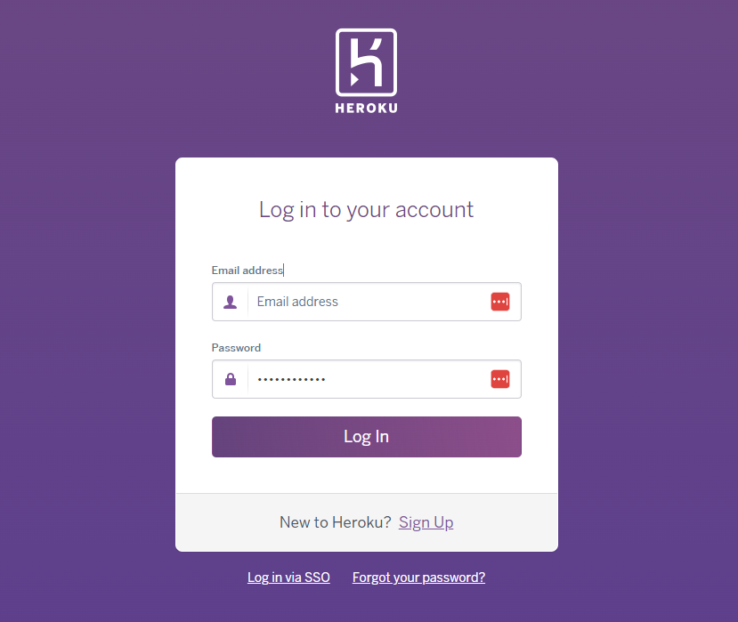

# Countdown Game
(Developer: Matthew Shepherd)


[Live webpage](https://countdown-game-ccaca8c4e1a7.herokuapp.com/)

## Table of Contents

1. [Project Goals](#project-goals)
    1. [User Goals](#user-goals)
    2. [Site Owner Goals](#site-owner-goals)
2. [User Experience](#user-experience)
    1. [Target Audience](#target-audience)
    2. [User Requirements and Expectations](#user-requirements-and-expectations)
    3. [User Stories](#user-stories)
3. [Technical Design](#design)
    1. [Design Choices](#design-choices)
    2. [Colour](#colours)
4. [Technologies Used](#technologies-used)
    1. [Languages](#languages)
    2. [Frameworks & Tools](#frameworks-&-tools)
5. [Features](#features)
6. [Testing](#testing)
    1. [Browser compatibility](#browser-compatability)
    2. [PEP8 Python Validator](#PEP8-Python-Validator)
    3. [Manual Testing](#manual-testing)
    4. [Automated Testing](#automated-testing)
    5. [Testing user stories](#testing-user-stories)
8. [Bugs](#Bugs)
9. [Deployment](#deployment)
    - [Deploying in Heroku](#deploying-the-website-in-heroku)
    - [Forking the GitHub Repository](#forking-the-github-repository)
    - [Cloning of Repository i GitHub](#cloning-the-repository-in-github)
10. [Credits](#credits)
11. [Acknowledgements](#acknowledgements)

## Project Goals 
The goals of this app include:

### Site Owner Goals
- Create a fun interactive game that furthers my understanding of problem solving through code and the Python language
- Ensure the user understands the rules of the game
- Ensure the user is provided with clear instructions on how to play on each screen
- Ensure the user is provided with clear feedback on any errors and how to proceed
- Allow the user to keep track of their score in the game
- Allow the user to have thier score displaye don the leaderboard if it is a top ten high score

### User Goals
- Play a fun, family friendly, interactive online numbers and words puzzle game similar to the U.K. T.V. gameshow Countdown 
- Quickly understand the rules of the game and how to play
- Be able to keep track of the game score and try to beat their previous high score
- Learn from the game through suggested words and number solutions 
- Play the game as often as desired
- Achieve a top ten high score that appears on the game leaderboard

[Back to Table of Contents](#table-of-contents)

## User Experience

### Target Audience
- Countdown is typically played by anyone age 12 and up, that can follow the rules to solve challenging word and number games.

### User Requirements and Expectations
- An intuitive and easy to navigate game interface
- A fun, family friendly, and educational gameplay experience with feedback on word and number game solutions
- Ability to quickly find game rules, view the score leaderboard, or start the game
- Ability to personalise the game by entering a player name
- Score tracking during the game and feedback if a top ten score is achieved
- Clear feedback on any input errors during gameplay and how to proceed
- Ability to have their name and score added to the leaderboard if a top ten score is achieved


### User Stories
I have divided my user stories into users and the site owner, as each of these users will have a distinct set of needs and goals.

#### Users
1. As a user, I want to play a fun, family friendly, challenging, and educational game.
2. As a user, I want to be able to view the rules of the game.
3. As a user, I want to be able to view the high scores leaderboard.
4. As a user, I want to be able to start a new game and enter my player name.
5. As a user, I want the game to remember my name if I play again and have the choice to keep my name or change it.
6. As a user, I want my input to be validated with clear feedback on how to correct any input errors. 
7. As a user, I want to be given clear instructions on each screen on how to play the game and how to progress.
8. As a user, I want feedback on my word and number guesses with potential solutions provided by the game.
9. As a user, I want to be provided with a score for each round and keep track of my current score and previous high score as the game progresses.
10. As a user, I want to be told when the game is over, the score I achieved, my high score, and be shown the leaderboard if I achieve a top ten high score.

#### Site Owner 
11. As the site owner, I want to provide a fun, family friendly, challenging, and educational game.
12. As the site owner, I want to ensure users understand the rules of the game and are provided clear instrcutions on how to play throughout the game.
13. As the site owner, I want to ensure input is validated to avoid the game breaking or errors displaying tha twill cause a poor user experience.
14. As the site owner, I want to ensure the user can keep playing the game while retining their name and high score.

[Back to Table of Contents](#table-of-contents)

## Technical Design

### Flowchart


### Data Model
- Five classes were used to represent key elements of the game:
    - Screen - Contains the attributes and methods of all game screen elements to be rendered. Called by round_handler to create Screen object instances to render the correct screen elements depending on the screen_data_param and/or round_number.
    - Player - Contains all player attributes. Keeps track of player name, score, letters, numbers, and words as the player progresses through rounds of the game. Contains a method to update player score.
    - Numbers - Contains all types of numbers to choose from and solve for in the numbers round and numbers generation methods.
    - Letters - Contains all letter types and letters to choose from in the letters round and letter generation methods.
    - Conundrums - Contains the Conundrum word attributes for the Conundrum round and methods to populate and solve the conundrum.
- Three text files were used to store and reuse blocks of ASCII art and text to be displayed at the beginning of the game screen render or on the rules screen.
    - intro_screen_data.txt - Welcome message in ASCII tiles and sub-heading
    - game_screen_data.txt - Countdown heading in ASCII tiles
    - rules_screen_data.txt - Rules heading in ASCII tiles and rules text
- A Set was used to create a word set against which the anagram solver could check for valid words. This was used instead of checking against PyDictionary as calls to PyDictionary for a large number of potential words turned out to be expensive, blocking code execution for long periods of time.
    - word_set.py
- A List was used to store nine letter words for use in the conundrum round as anagrams. This was used instead of word_set as the larger set of words contains less common words that would be harder for the user to guess. The list was genereatd from a set of commonly used 9 letter words.
    - nine_letter_word_list.py
- Google Sheets and the Google Sheets API was used to store high score data to create the top ten leaderboard. This allows player names and scores to persist beyong the game session if the user acieves a top ten high score.


[Back to Table of Contents](#table-of-contents)

## Technologies Used

### Languages
- [Python](https://www.python.org/)

### Tools
- [Git](https://git-scm.com/)
- [GitHub](https://github.com/)
- [CodeAnywhere](https://codeanywhere.com/)
- [Heroku](https://heroku.com/)

### Python Libraries
- [time](https://docs.python.org/3/library/time.html) was used to calculate time taken for the user to submit a value in the timed input and to access the sleep method to pause code execution.
- [re](https://docs.python.org/3/library/re.html) was used to access the search and findall methods and use regular experssions in the game's validation function to find valid and invalid characters in user input.
- [random](https://docs.python.org/3/library/random.html) was used to access the following methods: radint to generate random 3 digit integers in the numbers round; sample to randomly select letters, numbers, and conundrum words; and shuffle to shuffle the list of vowels and consonants and to generate variations of the conundrum letters to find potential anagram solutions.
- [termios](https://docs.python.org/3/library/termios.html) was used in the wait_for_keypress function to pause code execution until a key is pressed. The following methods were used: tcgetattr to retrieve the current terminal attributes associated with the standard input (stdin), tcsetattr to restore the original terminal settings after modifying them temporarily for capturing user input, TCSADRAIN is used to indicate that the changes to the terminal attributes stored should be applied after any pending output from the terminal has been transmitted.
- [sys](https://docs.python.org/3/library/sys.html) was used in the wait_for_keypress function to pause code execution until a key is pressed. The following methods were used: sys.stdin to access methods for reading input from the user such as sys.stdin.read; sys.stdin.fileno to return the file descriptor associated with the standard input; sys.stdin.flush to clear the internal buffer associated with the standard input
- [tty](https://docs.python.org/3/library/tty.html) was used to access the setraw metod to sets the terminal mode to raw mode for the standard input (stdin). In raw mode, input is read character by character without any line editing or processing.
- [collections](https://docs.python.org/3/library/collections.html) was used to access the Counter method which was used to create dictionaries of letter and number counts to check the user's inputted letter or numbers only used the available letters or numbers.
- [unittest](https://docs.python.org/3/library/unittest.html) was used to create automated unit tests of the game's validation functions

### Third Party Python Libraries
- [Colorama](https://pypi.org/project/colorama/) was used to acess the Fore, Back, Style and clear_screen methods to change terminal background and text colours and to clear the terminal screen.
- [Inputimeout](https://pypi.org/project/inputimeout/) was used to create timed user inputs for the guessing stage of each round. 
- [Art](https://pypi.org/project/art/) was used to acess the text2art method to convert text to ASCII art for the screen headings.
- [Num2words](https://pypi.org/project/num2words/) was used to convert round numbers to their word equivalent to print as screen headings for each new round.
- [Pager](https://pypi.org/project/pager/) was used to output the rules_screen_data text file on the rules screen in a paged format, pausing output thwen the terminal screen is full of text until the user presses a key to load the next section of the rule file's content.
- [PyDictionary](https://pypi.org/project/PyDictionary/) was used to check the user's inputted words are valid and to retieve word meanings for suggested word solutions on the letters round feedback screen.
- [Alt-profanity-check](https://pypi.org/project/alt-profanity-check/) was used to check the user's name and solution input text doesn't contain profanity and to check the conundrum word doesn't contain profanity.  
- [Numexpr](https://pypi.org/project/numexpr/2.6.1/) was used to evaluate the user's number round string to return the result of the user's inputted expression to compare to the target number. This was used to avoud using insecure methods such as eval().
- [anagram_solver](https://github.com/patrickleweryharris/anagram-solver) was used to find the longest potential words using the letters provided in the letters round so the user could learn potential approaches to solving the problem. As a 9 letter word can generate 362,880 permutations, brute force checking all of these against a dictionary is extermely time consuming. As such, I took the approach of generating 3 random lists of the provided letters for words between 9 and 4 letters long and checking these against anagram solver's dictionary. Not ideal, but functional.
- [Countdown_numbers_solver](https://pypi.org/project/countdown-numbers-solver/) was used to provide the user with solutions to the numbers round on the numbers round feedback screen so the user could learn potential approaches to solving the problem. 
- [gspread](https://docs.gspread.org/en/v5.10.0/) was used to access and update the the high score leaderboard worksheet via Google Sheets.
- [google.oauth2.service_account](https://google-auth.readthedocs.io/en/master/reference/google.oauth2.service_account.html) was used to authorise the connection with the Google Sheets API to access the high score leaderboard worksheet.
- [prettytable](https://pypi.org/project/prettytable/) was used to provide an ASCII formatted table layout for the leaderboard high scores when output in the terminal.


[Back to Table of Contents](#table-of-contents)

## Features
The game consists of a series of screens with the following features:

### Existing Features

### Introduction Screen
- 
- User stories covered: 

<details><summary>Screenshots</summary>

</details>

### Rules Screen
- 
- User stories covered: 

<details><summary>Screenshots</summary>

</details>

### High Scores Screen
- 
- User stories covered: 

<details><summary>Screenshots</summary>

</details>

### Enter Name Screen
- 
- User stories covered: 

<details><summary>Screenshots</summary>
Enter Name Screen:


Enter Name Screen Remembers Name from Previous Game:

</details>

### Letters Round Screen
- 
- User stories covered: 

<details><summary>Screenshots</summary>

</details>

### Show Letters Screen
- 
- User stories covered: 

<details><summary>Screenshots</summary>

</details>

### Letters Guess Screen
- 
- User stories covered: 

<details><summary>Screenshots</summary>

</details>

### Letters Feedback Screen
- Anagram solver
- User stories covered: 

<details><summary>Screenshots</summary>
Letters Feedback Screen:


Letters Feedback Screen with Solutions:

</details>

### Numbers Round Screen
- 
- User stories covered: 

<details><summary>Screenshots</summary>

</details>

### Show Numbers Screen
- 
- User stories covered: 

<details><summary>Screenshots</summary>

</details>

### Numbers Guess Screen
- 
- User stories covered: 

<details><summary>Screenshots</summary>

</details>

### Numbers Feedback Screen
- Countdown solver
- User stories covered: 

<details><summary>Screenshots</summary>
Numbers Feedback Screen:


Numbers Feedback Screen with Solutions:

</details>

### Show Conundrum Screen
- 
- User stories covered: 

<details><summary>Screenshots</summary>

</details>

### Conundrum Guess Screen
- 
- User stories covered: 

<details><summary>Screenshots</summary>

</details>

### Conundrum Feedback Screen
- 
- User stories covered: 

<details><summary>Screenshots</summary>

</details>

### Game Over Screen
- 
- User stories covered: 

<details><summary>Screenshots</summary>


</details>

### Features Left to Implement
- On screen countdown timer - Printing a constantly updating countdown timer along with an input in the terminal caused the cursor to move up and down and user input to be broken, leading to a poor user experience (even while using threading). To implement this in the future will likely need a more sophisticated GUI using something like curses and threading.
- Better profanity check - The profanity check library is limited in its effectiveness at detecting profane words within a longer string, and detects some other common harmless words as profane. Other profanity filter libraries should be explored in future versions.
- Better anagram solver - The anagram solver is very limited, often returning words shorter than the player's guess or finding words whose meanings aren't found in PyDictionary. This is because brute force checking all 362,880 permutations of porvided letters against a dictionary is extermely time consuming, blocking code execution for a long time. A limited brute force check of random letter combinations using the anagram solver provided a limited but working solution. More sophisticated anagram solving techniques are documented and should be explore din the future.
- Single dictionary - as noted in the bugs section above two seprate dictioanries are used to check word meanings and find potential word solutions in the letters round. Using a larger single dictionary in the future will help elimiate bugs and provide the user with a better experience.


[Back to Table of Contents](#table-of-contents)

## Testing

### Browser compatability
The game's Heroku index page was was tested on the following browsers:
- Google Chrome
- Mozilla Firefox
- Microsoft Egde

### PEP8 Python Validator
The PEP8 Python Validator (from Code Institute) was used to validate all Python code. All files pass with no errors no warnings to show.
<details>
<summary>run.py</summary>
    
</details>

<details>
<summary>validation.py</summary>
    
</details>

<details>
<summary>test_validation.py</summary>
    
</details>

<details>
<summary>word_set.py</summary>
    
</details>

<details>
<summary>nine_letter_word_list.py</summary>
    
</details>

### Automated Testing
Thirteen unit tests were written to test the project's validation functions. The tests check that the validation functions, which check user input values, return the expected results.

One test failed for validate_user_numbers function, which higlighted the need to check for a sting that contains just spaces. This was corrected using the  isspace() method.

After this all tests passed OK.

<details>
<summary>Unit Test Results</summary>
    
        
</details>

### Manual Testing
#### Testing user stories

#### Users

1. As a user, I want to play a fun, family friendly, challenging, and educational game.

| **Feature** | **Action** | **Expected Result** | **Actual Result** |
|-------------|------------|---------------------|-------------------|
| | | |
| | | |
| | | |

<details><summary>Screenshots</summary>

</details>

2. As a user, I want to be able to view the rules of the game.

| **Feature** | **Action** | **Expected Result** | **Actual Result** |
|-------------|------------|---------------------|-------------------|
| | | |
| | | |
| | | |

<details><summary>Screenshots</summary>

</details>

3. As a user, I want to be able to view the high scores leaderboard.

| **Feature** | **Action** | **Expected Result** | **Actual Result** |
|-------------|------------|---------------------|-------------------|
| | | |
| | | |
| | | |

<details><summary>Screenshots</summary>

</details>

4. As a user, I want to be able to start a new game and enter my player name.

| **Feature** | **Action** | **Expected Result** | **Actual Result** |
|-------------|------------|---------------------|-------------------|
| | | |
| | | |
| | | |

<details><summary>Screenshots</summary>

</details>

5. As a user, I want the game to remember my name if I play again and have the choice to keep my name or change it.

| **Feature** | **Action** | **Expected Result** | **Actual Result** |
|-------------|------------|---------------------|-------------------|
| | | |
| | | |
| | | |

<details><summary>Screenshots</summary>

</details>

6. As a user, I want my input to be validated with clear feedback on how to correct any input errors.

| **Feature** | **Action** | **Expected Result** | **Actual Result** |
|-------------|------------|---------------------|-------------------|
| | | |
| | | |
| | | |

<details><summary>Screenshots</summary>

</details>

7. As a user, I want to be given clear instructions on each screen on how to play the game and how to progress.

| **Feature** | **Action** | **Expected Result** | **Actual Result** |
|-------------|------------|---------------------|-------------------|
| | | |
| | | |
| | | |

<details><summary>Screenshots</summary>

</details>

8. As a user, I want feedback on my word and number guesses with potential solutions provided by the game.

| **Feature** | **Action** | **Expected Result** | **Actual Result** |
|-------------|------------|---------------------|-------------------|
| | | |
| | | |
| | | |

<details><summary>Screenshots</summary>

</details>

9. As a user, I want to be provided with a score for each round and keep track of my current score and previous high score as the game progresses.

| **Feature** | **Action** | **Expected Result** | **Actual Result** |
|-------------|------------|---------------------|-------------------|
| | | |
| | | |
| | | |

<details><summary>Screenshots</summary>

</details>

10. As a user, I want to be told when the game is over, the score I achieved, my high score, and be shown the leaderboard if I achieve a top ten high score.

| **Feature** | **Action** | **Expected Result** | **Actual Result** |
|-------------|------------|---------------------|-------------------|
| | | |
| | | |
| | | |

<details><summary>Screenshots</summary>

</details>

#### Site Owner

11. As the site owner, I want to provide a fun, family friendly, challenging, and educational game.  

| **Feature** | **Action** | **Expected Result** | **Actual Result** |
|-------------|------------|---------------------|-------------------|
| | | |
| | | |
| | | |

<details><summary>Screenshots</summary>

</details>

12. As the site owner, I want to ensure users understand the rules of the game and are provided clear instructions on how to play throughout the game.

| **Feature** | **Action** | **Expected Result** | **Actual Result** |
|-------------|------------|---------------------|-------------------|
| | | |
| | | |
| | | |

<details><summary>Screenshots</summary>

</details>

13. As the site owner, I want to ensure input is validated to avoid the game breaking or errors displaying that will cause a poor user experience.

| **Feature** | **Action** | **Expected Result** | **Actual Result** |
|-------------|------------|---------------------|-------------------|
| | | |
| | | |
| | | |

<details><summary>Screenshots</summary>

</details>

14. As the site owner, I want to ensure the user can keep playing the game while retining their name and high score.

| **Feature** | **Action** | **Expected Result** | **Actual Result** |
|-------------|------------|---------------------|-------------------|
| | | |
| | | |
| | | |

<details><summary>Screenshots</summary>

</details>


## Bugs

| **Bug** | **Fix** |
| ----------- | ----------- |
| Timed input countdown timer text overwriting input [Fixed but can be improved] | I tried to implement a countdown that printed the time remaining above or below while the input timer was still counting down. While I managed to use various threading solutions and libraries to allow the timer to update while the input was waiting for user input I couldn't get around the cursor moving up and down between the user input and the countdown line, which led to issues with user input getting overwritten or appearing on the wrong line. In the end I ahd to remove this feature. To implement in the future will likely need a more sophisticated GUI using something like curses and threading. |
| Player guesses from previous games carrying over to new game [Fixed] | When I implemented the feature alllowing players to start a new game and preserve thier name and score the player's previous word and number guesses were persisting. The expected behaviour of calling main() again woud be that new_player would be associated with a new Player object instance, which would not contain any attrbiute values of the previous new_player object. It turns out as I was setting the default value of the list attrbutes to [] instead of None, these lists were using the previous player object's list objects as default values, which caused previous user input to be carried over. Setting these default values to None and intialising the player attrbiutes as lists elsewhere fixed this issue. |
| PyDictionary printing error when meaning not found [Fixed] | When PyDictionary is used to find the meaning of a word it would print an error if the meaning was not found. I didn't want this default error text to display as the word validation is already handling telling the user if a word is found or not and if a meaning isn't found for a word it just prints the word. I found the solution to this bug in this [Stack Overflow answer](https://stackoverflow.com/a/52564005) by [Jenner Felton](https://stackoverflow.com/users/4044442/jenner-felton), which pointed to using a disable_errors paramter, meaning(word, disable_errors=True), which I didn't find in PyDictionary's documentation. |
| Word not found in PyDictionary but found in anagram solver dictionary [Not Fixed] | To provide potential word solutions to the letters rounds the anagram solver library and a scrabble word set was used as checking a large numer of random words against PyDictionary was too slow. PyDictionary is used instead of just using the Scrabble word set as it provides a much larger word set. This however introduces a bug whereby a word can be entered by the user and be rejected as it is not found in PyDictionary but is then found in the Scrabble word set and is suggested as a solution. This also produces a bug where some words suggested as solutions from the Scrabble word set will have no meanings returned as they don't exist in PyDictionary. Potential solutions to explore in future versions is to check the user's word against both dictionaries or to find a single dictionary with a large word set. |
| Numbers round string with space validation failure [Fixed] | Unit tests turned up the failure of the validate_user_numbers function to raise an error if the user submitted a string with just a space character. This was corrected using the isspace() method. |
| Numbers round consecutive operators [Fixed] | The validate_user_numbers function and unit tests failed to test for consecutive operators in a user string which caused evaluation of the user's expression by numexpr to fail and raise an error. This was fixed using a regular expression search of conesctuvei operators with no numbers between them. |
| Numbers round traiing and leading spaces [Fixed] | Add leading spaces to an expression caused evaluation of the user's expression by numexpr to fail and raise an error. This was fixed by using strip on the returned input string. |
| Numbers round empty input [Fixed] | If a user didn't enter a solution in the number's round and the input timed out no value was stored in the player guessed_solutions attribute, which raised an error when trying to access the solution for validation. This was fixed by checking the len of guessed_solutions[0] and if not greater than 0 setting the value to an empty string ''. |


[Back to Table of Contents](#table-of-contents)

## Deployment

### Deploying the website in Heroku:
- The website was deployed to Heroku using following steps:
#### Login or create an account at Heroku
- Make an account in Heroku and login

<details>
    <summary>Heroku Login Page</summary>
    
</details>

#### Creating an app
  - Create new app in the top right of the screen and add an app name.
  - Select region
  - Then click "create app".

<details>
    <summary>Create App</summary>
    
    
</details>

#### Open settings Tab
  ##### Click on Reveal Config Vars
  - Store CREDS file from Codeanywhere in key and add the values
  - Store PORT in key and value

<details>
    <summary>Config Vars</summary>
    
    
</details>

  ##### Add Buildpacks
  - From the settings tab find the 'Add buildpack' button
  - Add python buildpack first
  - Add Nodejs buildpack after that

<details>
    <summary>Buildpacks</summary>
    
</details>

 #### Open Deploy Tab
   ##### Choose deployment method
  - Connect GitHub
  - Login if prompted

<details>
    <summary>Deployment method</summary>
    
</details>

   ##### Connect to Github
  - Choose repositories you want to connect
  - Click "Connect"

<details>
    <summary>Repo Connect</summary>
    
</details>

  ##### Automatic and Manual deploy
  - Choose a method to deploy
  - After Deploy is clicked it will install various files

<details>
    <summary>Deploy methods</summary>
    
</details>

  ##### Final Deployment
  - A view button will display
  - Once clicked the website will open

<details>
    <summary> Deploy</summary>
    
</details>

### Forking the GitHub Repository
1. Go to the GitHub repository
2. Click on Fork button in top right corner
3. You will then have a copy of the repository in your own GitHub account.
4. [GitHub Repository](https://github.com/mat-shepherd/CI_PP3_COUNTDOWN_GAME)

### Cloning the repository in GitHub
1. Visit the GitHub page of the website's repository
2. Click the “Clone” button on top of the page
3. Click on “HTTPS”
4. Click on the copy button next to the link to copy it
5. Open your IDE
6. Type ```git clone <copied URL>``` into the terminal

[Back to Table of Contents](#table-of-contents)

## Credits

### Content
- The game concept was adapted from U.K. T.V. gameshow [Countdown](https://www.channel4.com/4viewers/take-part/countdown)
- The rules content was adapted from the [Countdown (game show) Wikipedia entry](https://en.wikipedia.org/wiki/Countdown_(game_show)#Format)
- The weighting of letters used in Scrabble, which was used to create the vowel and consonant lists, was found on the [Hasbro website](https://hasbro-new.custhelp.com/app/answers/detail/a_id/19/~/how-many-of-each-letter-tile-are-included-in-a-scrabble-game%3F)
- The word set used in word_set.py was generated from the [sowpods.txt](https://github.com/jesstess/Scrabble/blob/master/scrabble/sowpods.txt) Scrabble word set by [jesstess](https://github.com/jesstess)
- The nine letter word list in nine_letter_word_list.py was generated from the [Common 9 Letter Words list](https://www.unscramblerer.com/common-nine-letter-words/) by [unscramblerer.com](https://www.unscramblerer.com/)
- The letter tiles ASCII art pattern was adapted from a larger pattern found in the [Patterns section of ASCII Art Archive](https://www.asciiart.eu/art-and-design/patterns)


### Code
The markdown structure of this readme was based on the structure of the following readme.md files from other Code Institute student projects:
- https://github.com/4n4ru/CI_MS1_BodelschwingherHof
- https://github.com/jamie2210/CI_MS1_TBC
- https://github.com/jeremyhsimons/CI_PP3_DungeonEscape
- https://github.com/Sinha5714/hangman-pp3

The deployment steps for the project were adapted from the following readme.md file by Shubham Sinha:
- https://github.com/Sinha5714/hangman-pp3

The method and style code to center the Heroku terminal and change the background colour of the Heroku index page adapted from [Cesar Garcia's Rock, Paper, Scissors Project](https://the-ultimate-rps-75d98298966f.herokuapp.com/)

- Google sheets code: The method and code (Google drive and sheets scope and creds code, print_high_scores(), and store_high_scores() functions) to update, retrieve, and print leaderboard scores via a Google Sheet were adpated from the [LoveSandwiches Project](https://github.com/Code-Institute-Solutions/love-sandwiches-p5-sourcecode/tree/master/05-deployment/01-deployment-part-1) by the [Code Institute](https://codeinstitute.net/)

- Round numbers to ASCII words code: The use of the Num2Words library was based on a suggestion from [ChatGPT](https://chat.openai.com/) by [openai.com](https://openai.com/). The code was adapted from examples provided by [num2words](https://github.com/savoirfairelinux/num2words) by [savoirfairelinux](https://github.com/savoirfairelinux)

- Print text center code: The method for printing text in the center of the terminal was adapted from the [Python String center() Method](https://www.w3schools.com/python/ref_string_center.asp) article by [W3Schools](https://www.w3schools.com/)

- Rainbow text code: The approach to print text in a rainbow color (print_rainbow()) using Colorama was adapted from an answer by [ChatGPT](https://chat.openai.com/) by [openai.com](https://openai.com/)

- Wait for keypress code: The code to block code execution while waiting for the user to press a key (wait_for_keypress()) was largely provided by an answer from [ChatGPT](https://chat.openai.com/) by [openai.com](https://openai.com/)

- Randomly shuffle letters code: The method for shuffling a list of letters was adapted from the [Python Random shuffle() Method](https://www.w3schools.com/python/ref_random_shuffle.asp) article by [W3Schools](https://www.w3schools.com/)

- Dictionary meaning check code: The code used to check words against a dictionary and return their meanings (check_dictionary() and print_word_meaning()) uses the library and code examples provided in [PyDictionary](https://github.com/geekpradd/PyDictionary) written by [geekpradd](https://github.com/geekpradd)

- Fix for PyDictionary printing an error message when no meaning found was resolved using the meaning(word, disable_errors=True) example provided by this [Stack Overflow answer](https://stackoverflow.com/a/52564005) by [Jenner Felton](https://stackoverflow.com/users/4044442/jenner-felton).

- Profanity check code: The code used to check words against a profanity list (check_profanity()) uses the library and code examples provided in [Alt-profanity-check](https://github.com/dimitrismistriotis/alt-profanity-check) written by [dimitrismistriotis](https://github.com/dimitrismistriotis) which is based on [profanity-check](https://github.com/vzhou842/profanity-check) by [Victor Zhou](https://github.com/vzhou842)

- Check letters used validation: The approach to use a Counter to check the player's input only uses the chosen / conundrum letters (check_letters_used()) was adapted from an answer by [ChatGPT](https://chat.openai.com/) by [openai.com](https://openai.com/)

- Check numbers used validation: The approach to use a Counter to check the player's input only uses the chosen numbers (check_numbers_used()) was adapted from an answer by [ChatGPT](https://chat.openai.com/) by [openai.com](https://openai.com/)

- Anagram solver code: The code used to solve an anagram (longest_word()) uses the library and code examples (with an adapted approach - see [Anagram Solver Feature](#anagram-solver)) provided in [anagram-solver](https://github.com/patrickleweryharris/anagram-solver) written by [patrickleweryharris](https://github.com/patrickleweryharris)

- Numbers round string evaludation code: Knowing eval() isn't a secure approach to evaluating a string, a Google search turned up this [Stack Overflow answer](https://stackoverflow.com/a/43836903) by [MSeifert](https://stackoverflow.com/users/5393381/mseifert), which recommended the numexp library. The numbers round user solution input validation (validate_user_solution()) uses the library and code examples provided in [numexpr](https://github.com/pydata/numexpr) written by [pydata](https://github.com/pydata)

- Numbers round solver code: The code used to provide solutions to the numbers round (solve_numbers_round()) uses the library and code examples provided in [countdown-numbers-solver](https://github.com/exitexit) written by [exitexit](https://github.com/exitexit)

- Leaderboard table format: The use of PrettyTable to print the high score leaderboard in an ASCII table format was based on a suggestion by [ChatGPT](https://chat.openai.com/) by [openai.com](https://openai.com/)

[Back to Table of Contents](#table-of-contents)

## Acknowledgements
- My mentor Mo Shami for your support, guidance, and encouragement as always!
- Alan Bushell and the February 2023 Student Cohort for their knowledge sharing, advice, and camaraderie during our weekly standup calls and in Slack
- ... for reviewing my project and providing great constructive feedback
- The Code Institute and their tutor support team for an excellent experience and great support leading up to this second project
- My wife for her exceptional patience and support while I sat in front of the computer for days on end and for listening to my constant updates and ramblings about this third project
- My son  William for helping me test the game, providing feedback and ideas, and for spotting bugs!

[Back to Table of Contents](#table-of-contents)# Countdown Game
(Developer: Matthew Shepherd)


[Live webpage](https://countdown-game-ccaca8c4e1a7.herokuapp.com/)

## Table of Content

1. [Project Goals](#project-goals)
    1. [User Goals](#user-goals)
    2. [Site Owner Goals](#site-owner-goals)
2. [User Experience](#user-experience)
    1. [Target Audience](#target-audience)
    2. [User Requirements and Expectations](#user-requirements-and-expectations)
    3. [User Stories](#user-stories)
3. [Technical Design](#design)
    1. [Design Choices](#design-choices)
    2. [Colour](#colours)
4. [Technologies Used](#technologies-used)
    1. [Languages](#languages)
    2. [Frameworks & Tools](#frameworks-&-tools)
5. [Features](#features)
6. [Testing](#testing)
    1. [Browser compatibility](#browser-compatability)
    2. [PEP8 Python Validator](#PEP8-Python-Validator)
    3. [Manual Testing](#manual-testing)
    4. [Automated Testing](#automated-testing)
    5. [Testing user stories](#testing-user-stories)
8. [Bugs](#Bugs)
9. [Deployment](#deployment)
    - [Deploying in Heroku](#deploying-the-website-in-heroko)
    - [Forking the GitHub Repository](#forking-the-github-repository)
    - [Cloning of Repository i GitHub](#cloning-the-repository-in-github)
10. [Credits](#credits)
11. [Acknowledgements](#acknowledgements)

## Project Goals 
The goals of this app include:

### Site Owner Goals
- Create a fun interactive game that furthers my understanding of problem solving through code and the Python language
- Create an attractive and easy to use game
- Ensure the user understands the rules of the game
- Ensure the user is provided with clear instructions on how to play on each screen
- Ensure the user is provided with clear feedback on any errors and how to proceed
- Allow the user to keep track of their score in the game
- Allow the user to have thier score displaye don the leaderboard if it is a top ten high score

### User Goals
- Play a fun and interactive online numbers and words puzzle game similar to the U.K. T.V. gameshow Countdown 
- Quickly understand the rules of the game and how to play
- Be able to keep track of the game score and to try to beat their previous high score
- Play the game as often as desired
- Achieve a top ten high score that appears on the game leaderboard

[Back to Table of Contents](#table-of-contents)

## User Experience

### Target Audience
- Countdown is typically played by anyone age 12 and up, that can follow the rules to solve challenging word and number games.

### User Requirements and Expectations
- An intuitive and easy to navigate game interface
- A fun and educational gameplay experience with feedback on word and number game solutions
- Ability to quickly find game rules, view the score leaderboard, or start the game
- Ability to personalise the game by entering a player name
- Score tracking during the game and feedback if a top ten score is achieved
- Clear feedback on any input errors during gameplay and how to proceed
- Ability to have their name and score added to the leaderboard if a top ten score is achieved


### User Stories
I have divided my user stories into users and the site owner, as each of these users will have a distinct set of needs and goals.

#### Users
1. As a user, I want...


#### Site Owner 
13. As a site owner, I want...

[Back to Table of Contents](#table-of-contents)

## Technical Design

### Flowchart


### Data Model


[Back to Table of Contents](#table-of-contents)

## Technologies Used

### Languages
- Python

### Tools
- Git
- GitHub
- CodeAnywhere

### Python Libraries
[time](https://docs.python.org/3/library/time.html)
[re](https://docs.python.org/3/library/re.html)
[random](https://docs.python.org/3/library/random.html)
[termios](https://docs.python.org/3/library/termios.html)
[sys](https://docs.python.org/3/library/sys.html)
[tty](https://docs.python.org/3/library/tty.html)
[collections](https://docs.python.org/3/library/collections.html)

### Third Party Python Libraries
[PyDictionary](https://pypi.org/project/PyDictionary/)
[Colorama](https://pypi.org/project/colorama/)
[Alt-profanity-check](https://pypi.org/project/alt-profanity-check/)
[Numexpr](https://pypi.org/project/numexpr/2.6.1/)
[Pager](https://pypi.org/project/pager/)
[Inputimeout]()
[Art]()
[Num2words]()
[Countdown_numbers_solver]()
[gspread]()
[google.oauth2.service_account]()
[prettytable]()
[]()


[Back to Table of Contents](#table-of-contents)

## Features
The app consists of...

### Intro Screen
- 


### Enter Name Screen
- 


[Back to Table of Contents](#table-of-contents)

## Testing

### Browser compatability
The website was tested on the following browsers:
- Google Chrome
- Mozilla Firefox
- Microsoft Egde

### PEP8 Python Validator
The PEP8 Python Validator (from Code Institute) was used to validate all Python code. All files pass with no errors no warnings to show.
<details>
<summary>Run.py</summary>

</details>


### Manual Testing


### Automated Testing


### Testing user stories

1. As a user, 

| **Feature** | **Action** | **Expected Result** | **Actual Result** |
|-------------|------------|---------------------|-------------------|
| | | |
| | | |
| | | |

<details><summary>Screenshots</summary>

</details>


14. As the site owner,  

| **Feature** | **Action** | **Expected Result** | **Actual Result** |
|-------------|------------|---------------------|-------------------|
| | | |
| | | |
| | | |


<details><summary>Screenshots</summary>

</details>

15. As the site owner, 

| **Feature** | **Action** | **Expected Result** | **Actual Result** |
|-------------|------------|---------------------|-------------------|
| | | |
| | | |
| | | |

<details><summary>Screenshots</summary>

</details>


## Bugs

| **Bug** | **Fix** |
| ----------- | ----------- |
| | |
| | |
| | |
| | |


[Back to Table of Contents](#table-of-contents)

## Deployment

### Deploying the website in Heroko:
- The website was deployed to Heroko using following steps:
#### Login or create an account at Heroku
- Make an account in Heroko and login

<details>
    <summary>Heroko Login Page</summary>
    
</details>

#### Creating an app
  - Create new app in the top right of the screen and add an app name.
  - Select region
  - Then click "create app".

<details>
    <summary>Create App</summary>
    
</details>

#### Open settings Tab
  ##### Click on config var
  - Store CREDS file from gitpod in key and add the values
  - Store PORT in key and value

<details>
    <summary>Config var</summary>
    
</details>

  ##### Add Buildpacks
  - Add python buildpack first
  - Add Nodejs buildpack after that

<details>
    <summary>Buildpacks</summary>
    
</details>

 #### Open Deploy Tab
   ##### Choose deployment method
  - Connect GITHUB
  - Login if prompted

<details>
    <summary>Deployment method</summary>
    
</details>

   ##### Connect to Github
  - Choose repositories you want to connect
  - Click "Connect"

<details>
    <summary> Repo Connect</summary>
    
</details>

  ##### Automatic and Manual deploy
  - Choose a method to deploy
  - After Deploy is clicked it will install various file

<details>
    <summary> Deploy methods</summary>
    
</details>

  ##### Final Deployment
  - A view button will display
  - Once clicked the website will open

<details>
    <summary> Deploy</summary>
    
</details>

### Forking the GitHub Repository
1. Go to the GitHub repository
2. Click on Fork button in top right corner
3. You will then have a copy of the repository in your own GitHub account.
4. [GitHub Repository](https://github.com/mat-shepherd/CI_PP3_COUNTDOWN_GAME)

### Cloning the repository in GitHub
1. Visit the GitHub page of the website's repository
2. Click the “Clone” button on top of the page
3. Click on “HTTPS”
4. Click on the copy button next to the link to copy it
5. Open your IDE
6. Type ```git clone <copied URL>``` into the terminal

[Back to Table of Contents](#table-of-contents)

## Credits

### Content
In order of appearance:

Index Page
- [Image](https://www.hubspot.com/brand-kit-generator/) by [Author](https://www.hubspot.com/)
    <details><summary>Logo</summary>
    
    </details>   

  
### Code
The markdown structure of this readme was based on the structure of the following readme.md files from other Code Institute student projects:
- https://github.com/4n4ru/CI_MS1_BodelschwingherHof
- https://github.com/jamie2210/CI_MS1_TBC
- https://github.com/jeremyhsimons/CI_PP3_DungeonEscape

The deployment steps for the project were adapted from the following readme.md file by Jeremy Simons:
- https://github.com/jeremyhsimons/CI_PP3_DungeonEscape

[Back to Table of Contents](#table-of-contents)

## Acknowledgements
- My mentor Mo Shami for your support, guidance, and encouragement as always!
- Alan Bushell and the February 2023 Student Cohort for their knowledge sharing, advice, and camaraderie during our weekly standup calls and in Slack
- ... for reviewing my project and providing great constructive feedback
- The Code Institute and their tutor support team for an excellent experience and great support leading up to this second project
- My wife for her exceptional patience and support while I sat in front of the computer for days on end and for listening to my constant updates and ramblings about this third project
- My son  William for helping me test the game, providing feedback and ideas, and for spotting bugs!

[Back to Table of Contents](#table-of-contents)